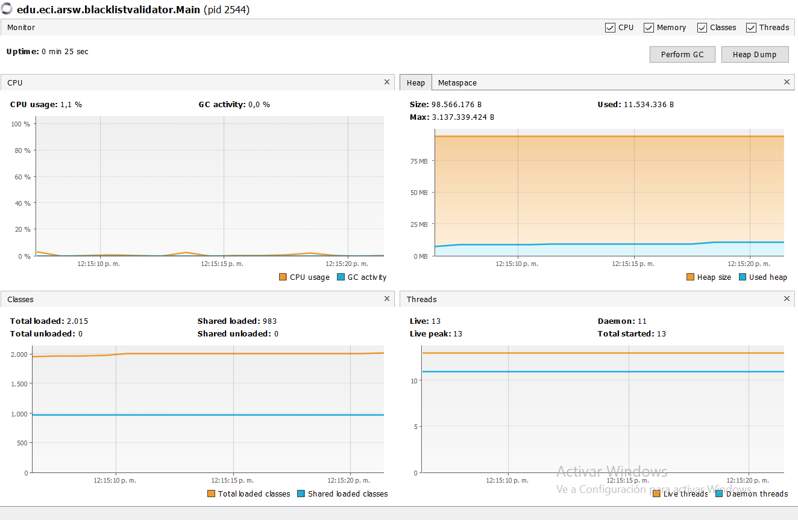
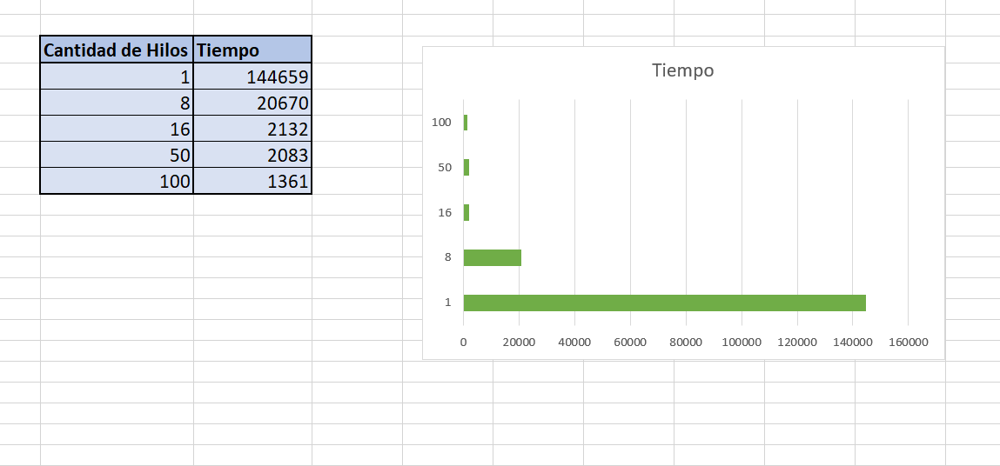

### Escuela Colombiana de Ingeniería
### Arquitecturas de Software - ARSW
## Ejercicio Introducción al paralelismo - Hilos - Caso BlackListSearch


### Dependencias:
####   Lecturas:
*  [Threads in Java](http://beginnersbook.com/2013/03/java-threads/)  (Hasta 'Ending Threads')
*  [Threads vs Processes]( http://cs-fundamentals.com/tech-interview/java/differences-between-thread-and-process-in-java.php)

### Descripción
  Este ejercicio contiene una introducción a la programación con hilos en Java, además de la aplicación a un caso concreto.
  

**Parte I - Introducción a Hilos en Java**

1. De acuerdo con lo revisado en las lecturas, complete las clases CountThread, para que las mismas definan el ciclo de vida de un hilo que imprima por pantalla los números entre A y B.
2. Complete el método __main__ de la clase CountMainThreads para que:
	1. Cree 3 hilos de tipo CountThread, asignándole al primero el intervalo [0..99], al segundo [99..199], y al tercero [200..299].
	2. Inicie los tres hilos con 'start()'.
	3. Ejecute y revise la salida por pantalla. 
	4. Cambie el incio con 'start()' por 'run()'. Cómo cambia la salida?, por qué?.
	
	
	El codigo se completo de la siguiente forma:
	
	 ```
	     public static void main(String a[]) {
        CountThread hilo1 = new CountThread(0, 99);
        CountThread hilo2 = new CountThread(100, 199);
        CountThread hilo3 = new CountThread(200, 299);
        Thread x = new Thread(hilo1);
        Thread y = new Thread(hilo2);
        Thread z = new Thread(hilo3);

        System.out.println("Con Run:");
        x.run();
        y.run();
        z.run();
        System.out.println("Con start:");
        x.start();
        y.start();
        z.start();


    }
	 ```
	
	Con el metodo "start()" aparentemente se demora mas en imprimir los numeros que con el metodo "run()" porque el metodo start crea un nuevo hilo y lo hace ejecutable y en run el nuevo hilo comienza su vida dentro de este método.
	

**Parte II - Ejercicio Black List Search**


Para un software de vigilancia automática de seguridad informática se está desarrollando un componente encargado de validar las direcciones IP en varios miles de listas negras (de host maliciosos) conocidas, y reportar aquellas que existan en al menos cinco de dichas listas. 

Dicho componente está diseñado de acuerdo con el siguiente diagrama, donde:

- HostBlackListsDataSourceFacade es una clase que ofrece una 'fachada' para realizar consultas en cualquiera de las N listas negras registradas (método 'isInBlacklistServer'), y que permite también hacer un reporte a una base de datos local de cuando una dirección IP se considera peligrosa. Esta clase NO ES MODIFICABLE, pero se sabe que es 'Thread-Safe'.

- HostBlackListsValidator es una clase que ofrece el método 'checkHost', el cual, a través de la clase 'HostBlackListDataSourceFacade', valida en cada una de las listas negras un host determinado. En dicho método está considerada la política de que al encontrarse un HOST en al menos cinco listas negras, el mismo será registrado como 'no confiable', o como 'confiable' en caso contrario. Adicionalmente, retornará la lista de los números de las 'listas negras' en donde se encontró registrado el HOST.


Al usarse el módulo, la evidencia de que se hizo el registro como 'confiable' o 'no confiable' se dá por lo mensajes de LOGs:

INFO: HOST 205.24.34.55 Reported as trustworthy

INFO: HOST 205.24.34.55 Reported as NOT trustworthy


Al programa de prueba provisto (Main), le toma sólo algunos segundos análizar y reportar la dirección provista (200.24.34.55), ya que la misma está registrada más de cinco veces en los primeros servidores, por lo que no requiere recorrerlos todos. Sin embargo, hacer la búsqueda en casos donde NO hay reportes, o donde los mismos están dispersos en las miles de listas negras, toma bastante tiempo.

Éste, como cualquier método de búsqueda, puede verse como un problema [vergonzosamente paralelo](https://en.wikipedia.org/wiki/Embarrassingly_parallel), ya que no existen dependencias entre una partición del problema y otra.

Para 'refactorizar' este código, y hacer que explote la capacidad multi-núcleo de la CPU del equipo, realice lo siguiente:

1. Cree una clase de tipo Thread que represente el ciclo de vida de un hilo que haga la búsqueda de un segmento del conjunto de servidores disponibles. Agregue a dicha clase un método que permita 'preguntarle' a las instancias del mismo (los hilos) cuantas ocurrencias de servidores maliciosos ha encontrado o encontró.

Para poder realizar esta implementacion, se realizo la clase BlackListSearchThread donde se realiza la busqueda del segmento perteneciente al conjunto de servidores que se encuentran disponibles:

```
package edu.eci.arsw.threads;

import edu.eci.arsw.spamkeywordsdatasource.HostBlacklistsDataSourceFacade;

import java.util.LinkedList;
import java.util.concurrent.atomic.AtomicInteger;

public class BlackListSearchThread extends Thread {
    private String ip;
    private int servidorInicial;
    private int servidorFinal;
    private LinkedList<Integer> blackListOcurrences;
    private static final int BLACK_LIST_ALARM_COUNT = 5;


    private AtomicInteger ocurrencesCount;
    private AtomicInteger checkedListCount;
    private HostBlacklistsDataSourceFacade facade;

    public BlackListSearchThread(String ip, int inicial, int fin, HostBlacklistsDataSourceFacade skds, AtomicInteger ocurrencesCount, AtomicInteger checkedListsCount, LinkedList<Integer> blackListOcurrences) {
        this.ip = ip;
        this.servidorInicial = inicial;
        this.servidorFinal = fin;
        this.facade = skds;
        this.ocurrencesCount = ocurrencesCount;
        this.checkedListCount = checkedListsCount;
        this.blackListOcurrences = blackListOcurrences;
    }

    public void run() {
        for (int i = servidorInicial; i < servidorFinal & ocurrencesCount.get() < BLACK_LIST_ALARM_COUNT; i++) {
            checkedListCount.getAndIncrement();
            if (facade.isInBlackListServer(i, ip)) {
                blackListOcurrences.add(i);
                ocurrencesCount.getAndIncrement();
            }
        }
    }

    public String getIp() {
        return ip;
    }

    public void setIp(String ip) {
        this.ip = ip;
    }

    public int getServidorInicial() {
        return servidorInicial;
    }

    public void setServidorInicial(int servidorInicial) {
        this.servidorInicial = servidorInicial;
    }

    public int getServidorFinal() {
        return servidorFinal;
    }

    public void setServidorFinal(int servidorFinal) {
        this.servidorFinal = servidorFinal;
    }

    public LinkedList<Integer> getBlackListOcurrences() {
        return blackListOcurrences;
    }

    public void setBlackListOcurrences(LinkedList<Integer> blackListOcurrences) {
        this.blackListOcurrences = blackListOcurrences;
    }

    public AtomicInteger getOcurrencesCount() {
        return ocurrencesCount;
    }

    public void setOcurrencesCount(AtomicInteger ocurrencesCount) {
        this.ocurrencesCount = ocurrencesCount;
    }

    public HostBlacklistsDataSourceFacade getFacade() {
        return facade;
    }

    public void setFacade(HostBlacklistsDataSourceFacade facade) {
        this.facade = facade;
    }
}

```

2. Agregue al método 'checkHost' un parámetro entero N, correspondiente al número de hilos entre los que se va a realizar la búsqueda (recuerde tener en cuenta si N es par o impar!). Modifique el código de este método para que divida el espacio de búsqueda entre las N partes indicadas, y paralelice la búsqueda a través de N hilos. Haga que dicha función espere hasta que los N hilos terminen de resolver su respectivo sub-problema, agregue las ocurrencias encontradas por cada hilo a la lista que retorna el método, y entonces calcule (sumando el total de ocurrencuas encontradas por cada hilo) si el número de ocurrencias es mayor o igual a _BLACK_LIST_ALARM_COUNT_. Si se da este caso, al final se DEBE reportar el host como confiable o no confiable, y mostrar el listado con los números de las listas negras respectivas. Para lograr este comportamiento de 'espera' revise el método [join](https://docs.oracle.com/javase/tutorial/essential/concurrency/join.html) del API de concurrencia de Java. Tenga también en cuenta:

	* Dentro del método checkHost Se debe mantener el LOG que informa, antes de retornar el resultado, el número de listas negras revisadas VS. el número de listas negras total (línea 60). Se debe garantizar que dicha información sea verídica bajo el nuevo esquema de procesamiento en paralelo planteado.

	* Se sabe que el HOST 202.24.34.55 está reportado en listas negras de una forma más dispersa, y que el host 212.24.24.55 NO está en ninguna lista negra.

Se reealizo la implementacion del metodo checkHost, para que este se encargue bajo las direcciones IP recibidas del host, las clasifica como disponibles confiables o no confiables

```
package edu.eci.arsw.blacklistvalidator;

import edu.eci.arsw.spamkeywordsdatasource.HostBlacklistsDataSourceFacade;
import edu.eci.arsw.threads.BlackListSearchThread;

import java.util.LinkedList;
import java.util.List;
import java.util.concurrent.atomic.AtomicInteger;
import java.util.logging.Level;
import java.util.logging.Logger;

/**
 * @author hcadavid
 */
public class HostBlackListsValidator {
    private static final int BLACK_LIST_ALARM_COUNT = 5;

    /**
     * Check the given host's IP address in all the available black lists,
     * and report it as NOT Trustworthy when such IP was reported in at least
     * BLACK_LIST_ALARM_COUNT lists, or as Trustworthy in any other case.
     * The search is not exhaustive: When the number of occurrences is equal to
     * BLACK_LIST_ALARM_COUNT, the search is finished, the host reported as
     * NOT Trustworthy, and the list of the five blacklists returned.
     *
     * @param ipaddress suspicious host's IP address.
     * @return Blacklists numbers where the given host's IP address was found.
     */
    public List<Integer> checkHost(String ipaddress, int n) {
        LinkedList<Integer> blackListOcurrences = new LinkedList<>();

        AtomicInteger ocurrencesCount = new AtomicInteger();
        AtomicInteger checkedListsCount = new AtomicInteger();

        HostBlacklistsDataSourceFacade skds = HostBlacklistsDataSourceFacade.getInstance();
        int totalServers = skds.getRegisteredServersCount();
        int avg = totalServers / n;
        int last = 0;
        int i = 0;
        int actualThread = 1;
        BlackListSearchThread[] hilos = new BlackListSearchThread[n];

        while (last < totalServers) {
            if (actualThread != n) {
                hilos[i] = new BlackListSearchThread(ipaddress, last, last + avg, skds, ocurrencesCount, checkedListsCount, blackListOcurrences);
                actualThread++;
                last += avg;
            } else {
                int a = n == 1 ? totalServers : last + (totalServers % n);
                hilos[i] = new BlackListSearchThread(ipaddress, last, a, skds, ocurrencesCount, checkedListsCount, blackListOcurrences);
                last = totalServers;
            }
            i++;
        }
        for (BlackListSearchThread t : hilos) {
            t.start();
        }
        for (BlackListSearchThread t : hilos) {
            try {
                t.join();
            } catch (InterruptedException e) {
                t.interrupt();
            }
        }
        if (ocurrencesCount.get() >= BLACK_LIST_ALARM_COUNT) {
            skds.reportAsNotTrustworthy(ipaddress);
        } else {
            skds.reportAsTrustworthy(ipaddress);
        }
        LOG.log(Level.INFO, "Checked Black Lists:{0} of {1}", new Object[]{checkedListsCount, skds.getRegisteredServersCount()});
        return blackListOcurrences;
    }

    private static final Logger LOG = Logger.getLogger(HostBlackListsValidator.class.getName());


}
```

**Parte II.I Para discutir la próxima clase (NO para implementar aún)**

La estrategia de paralelismo antes implementada es ineficiente en ciertos casos, pues la búsqueda se sigue realizando aún cuando los N hilos (en su conjunto) ya hayan encontrado el número mínimo de ocurrencias requeridas para reportar al servidor como malicioso. Cómo se podría modificar la implementación para minimizar el número de consultas en estos casos?, qué elemento nuevo traería esto al problema?


+ Para tener una posibilidad de que sea mas eficiente el manejo del tiempo, una opcion podria ser tener en cuenta la cantidad de ocurrencias maliciosas de esta forma se deja de buscar innecesariamente


**Parte III - Evaluación de Desempeño**

A partir de lo anterior, implemente la siguiente secuencia de experimentos para realizar las validación de direcciones IP dispersas (por ejemplo 202.24.34.55), tomando los tiempos de ejecución de los mismos (asegúrese de hacerlos en la misma máquina):

1. Un solo hilo.


2. Tantos hilos como núcleos de procesamiento (haga que el programa determine esto haciendo uso del [API Runtime](https://docs.oracle.com/javase/7/docs/api/java/lang/Runtime.html)).

3. Tantos hilos como el doble de núcleos de procesamiento.

4. 50 hilos.

5. 100 hilos.


Al iniciar el programa ejecute el monitor jVisualVM, y a medida que corran las pruebas, revise y anote el consumo de CPU y de memoria en cada caso. 

Con lo anterior, y con los tiempos de ejecución dados, haga una gráfica de tiempo de solución vs. número de hilos. Analice y plantee hipótesis con su compañero para las siguientes preguntas (puede tener en cuenta lo reportado por jVisualVM):



1. Según la [ley de Amdahls](https://www.pugetsystems.com/labs/articles/Estimating-CPU-Performance-using-Amdahls-Law-619/#WhatisAmdahlsLaw?):

	, donde _S(n)_ es el mejoramiento teórico del desempeño, _P_ la fracción paralelizable del algoritmo, y _n_ el número de hilos, a mayor _n_, mayor debería ser dicha mejora. Por qué el mejor desempeño no se logra con los 500 hilos?, cómo se compara este desempeño cuando se usan 200?. 

	En el tiempo que toma la aplicacion ejecutandose es posible observar que al aumentar la cantidad de hilos se obtendra una optimizacion en el tiempo, ya que este sera menor al ser ejecutado por mas hilos, sin embargo al hacer una comparacion entre 200 hilos y 500 hilos, no hay una diferencia tan significativa en el rendimiento

2. Cómo se comporta la solución usando tantos hilos de procesamiento como núcleos comparado con el resultado de usar el doble de éste?.

	Entre mas hilos se esten ejecutando el tiempo de ejecucion mejora al disminuir el tiempo de ejecucion, sin embargo no es tan representativa la diferencia

3. De acuerdo con lo anterior, si para este problema en lugar de 100 hilos en una sola CPU se pudiera usar 1 hilo en cada una de 100 máquinas hipotéticas, la ley de Amdahls se aplicaría mejor?. Si en lugar de esto se usaran c hilos en 100/c máquinas distribuidas (siendo c es el número de núcleos de dichas máquinas), se mejoraría?. Explique su respuesta.

	Se hace la suposicion de que entre mas hilos se esten ejecutando mayor sera el rendimiento y asi mismo el tiempo disminuira segun la ley de Amdahls, de esta manera si usamos una computadora para ejecutar 100 hilos obtendríamos un beneficio en la eficacia del desarrollo de estos, si usamos 100 computadoras para desarrollar un hilo cada una de ellas podríamos concluir que seria un gasto innecesario de recursos y el tiempo aumentaría al desarrollarse este tipo de procedimientos.

## Authors

+ Santiago Buitrago
+ Steven Garzon

